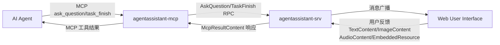

# Agent Assistant 需求文档

## 1. 项目概述

Agent Assistant 是一个基于 MCP (Model Context Protocol) 协议的 AI 助手中间件，它通过优化 AI agent 与用户之间的交互流程，提供更高效、可控的对话体验。

### 1.1 核心价值

- **成本优化**：通过合并多次工具调用为单次反馈请求，显著降低平台资源消耗
- **效率提升**：减少不必要的推测性操作，提高任务完成效率
- **增强可控性**：通过明确的用户确认机制，确保 AI 行为符合预期
- **平台兼容**：支持主流的 AI agent 平台

### 1.2 支持平台

- [Cursor](https://www.cursor.com)
- [Cline](https://cline.bot)
- [Windsurf](https://windsurf.com)
- [Augment](https://www.augmentcode.com)
- [Trae](https://www.trae.ai)

## 2. 系统架构

### 2.1 核心组件

1. **agentassistant-mcp**：MCP 协议接口层，负责与 AI agent 通信，使用golang实现
   - 提供两个主要工具：`ask_question` 和 `task_finish`
   - 支持项目目录、超时设置等参数配置
   - 通过 RPC 与服务层通信

2. **agentassistant-srv**：核心服务层，处理请求路由和消息转发，使用golang实现
   - 实现 `SrvAgentAssist` 服务，包含 `AskQuestion` 和 `TaskFinish` RPC 方法
   - 处理多种内容类型的消息转发和响应

3. **Web 界面**：用户交互界面，展示请求并收集反馈

4. **RPC 及其交互协议**：用于 agentassistant-mcp 与 agentassistant-srv与 Web 界面之间的通信，使用protobuf定义的[connectrpc](https://connectrpc.com)

### 2.2 支持的内容类型

系统支持多种内容类型的传输和处理：

- **TextContent**：文本内容，包含纯文本数据
- **ImageContent**：图像内容，支持 Base64 编码的图像数据和 MIME 类型
- **AudioContent**：音频内容，支持 Base64 编码的音频数据和 MIME 类型
- **EmbeddedResource**：嵌入式资源，支持 URI 引用和可选的二进制数据

### 2.3 RPC 服务定义

**SrvAgentAssist** 服务提供以下 RPC 方法：

1. **AskQuestion**：AI agent 向用户提问并等待反馈
   - 请求参数：项目目录、问题内容、超时时间（默认600秒）
   - 响应：错误状态、元数据、多种类型的内容列表

2. **TaskFinish**：AI agent 完成任务并请求用户确认
   - 请求参数：项目目录、任务摘要、超时时间（默认600秒）
   - 响应：错误状态、元数据、多种类型的内容列表

### 2.4 数据流



## 3. 工作流程

### 3.1 询问流程 (ask_question)

1. **请求发起**：AI agent 通过 MCP 协议调用 `ask_question` 工具
   - 参数：项目目录 (project_directory)、问题内容 (question)、超时时间 (timeout，默认600秒)
2. **请求转发**：`agentassistant-mcp` 通过 `AskQuestion` RPC 将请求转发至 `agentassistant-srv` 服务
3. **消息广播**：`agentassistant-srv` 将问题广播给所有在线的 Web 用户
4. **用户响应**：Web 用户界面展示问题内容，等待用户输入反馈
   - 支持文本、图像、音频、嵌入式资源等多种反馈类型
5. **结果返回**：用户反馈通过 `AskQuestionResponse` 返回给 `agentassistant-srv`
6. **响应处理**：`agentassistant-srv` 将包含 `McpResultContent` 的响应返回给 AI agent

### 3.2 任务完成流程 (task_finish)

1. **任务完成通知**：AI agent 通过 MCP 协议调用 `task_finish` 工具
   - 参数：项目目录 (project_directory)、任务摘要 (summary)、超时时间 (timeout，默认600秒)
2. **请求转发**：`agentassistant-mcp` 通过 `TaskFinish` RPC 将请求转发至 `agentassistant-srv` 服务
3. **消息广播**：`agentassistant-srv` 将任务完成信息广播给所有在线的 Web 用户
4. **用户确认**：Web 用户界面展示任务摘要，等待用户确认或提供额外反馈
5. **结果返回**：用户确认信息通过 `TaskFinishResponse` 返回给 `agentassistant-srv`
6. **响应处理**：`agentassistant-srv` 将包含 `McpResultContent` 的响应返回给 AI agent

## 4. 集成指南

### 4.1 MCP 工具使用

Agent Assistant 提供两个主要的 MCP 工具：

#### 4.1.1 ask_question 工具

用于 AI agent 向用户提问并获取反馈。

**参数：**

- `project_directory` (必需)：当前项目目录路径
- `question` (必需)：要向用户提出的问题
- `timeout` (可选)：超时时间（秒），默认为 600 秒

**返回：**

- 包含 TextContent、ImageContent、AudioContent 或 EmbeddedResource 的内容列表

#### 4.1.2 task_finish 工具

用于 AI agent 完成任务时请求用户确认。

**参数：**

- `project_directory` (必需)：当前项目目录路径
- `summary` (必需)：任务完成摘要
- `timeout` (可选)：超时时间（秒），默认为 600 秒

**返回：**

- 包含 TextContent、ImageContent、AudioContent 或 EmbeddedResource 的内容列表

### 4.2 提示工程

为获得最佳效果，请在 AI agent 的提示词中添加以下规则：

```markdown
# MCP agent assistant 规则

1. 在任何流程、任务、对话进行时，无论是询问、回复、或完成阶段性任务，皆必须调用相应的 MCP 工具：
   - 需要用户反馈时使用 `ask_question` 工具
   - 完成任务时使用 `task_finish` 工具
2. 每当收到用户反馈，若反馈内容非空，必须根据反馈内容调整行为，并在需要时再次调用相应工具。
3. 仅当用户明确表示「结束」或「不再需要交互」时，才可停止调用 MCP 工具，流程才算结束。
4. 除非收到结束指令，否则所有关键步骤都必须通过 MCP 工具与用户确认。
5. 完成任务前，必须使用 `task_finish` 工具向用户报告任务完成情况并请求确认。
6. 调用工具时务必提供正确的 `project_directory` 参数，确保上下文准确性。
```

### 4.3 内容类型处理

系统支持多种内容类型的处理，AI agent 应根据用户反馈的内容类型进行相应处理：

- **文本反馈**：直接处理 TextContent 中的文本信息
- **图像反馈**：处理 ImageContent 中的 Base64 编码图像数据
- **音频反馈**：处理 AudioContent 中的 Base64 编码音频数据
- **资源引用**：处理 EmbeddedResource 中的 URI 引用或嵌入数据
