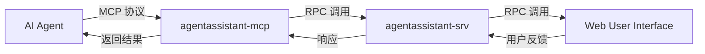

# Agent Assistant 需求文档

## 1. 项目概述

Agent Assistant 是一个基于 MCP (Model Context Protocol) 协议的 AI 助手中间件，它通过优化 AI agent 与用户之间的交互流程，提供更高效、可控的对话体验。

### 1.1 核心价值

- **成本优化**：通过合并多次工具调用为单次反馈请求，显著降低平台资源消耗
- **效率提升**：减少不必要的推测性操作，提高任务完成效率
- **增强可控性**：通过明确的用户确认机制，确保 AI 行为符合预期
- **平台兼容**：支持主流的 AI agent 平台

### 1.2 支持平台

- [Cursor](https://www.cursor.com)
- [Cline](https://cline.bot)
- [Windsurf](https://windsurf.com)
- [Augment](https://www.augmentcode.com)
- [Trae](https://www.trae.ai)

## 2. 系统架构

### 2.1 核心组件

1. **agentassistant-mcp**：MCP 协议接口层，负责与 AI agent 通信，使用golang实现
2. **agentassistant-srv**：核心服务层，处理请求路由和消息转发，使用golang实现
3. **Web 界面**：用户交互界面，展示请求并收集反馈,
4. **RPC 及其交互协议**：用于 agentassistant-mcp 与 agentassistant-srv与 Web 界面之间的通信，使用protobuf定义的[connectrpc](https://connectrpc.com)

### 2.2 数据流



## 3. 工作流程

1. **请求发起**：AI agent 通过 MCP 协议调用 `agentassistant-mcp` CLI 工具
2. **请求转发**：`agentassistant-mcp` 通过 RPC 将请求转发至 `agentassistant-srv` 服务
3. **消息广播**：`agentassistant-srv` 将请求广播给所有在线的 Web 用户
4. **用户响应**：Web 用户界面展示请求内容，等待用户输入反馈
5. **结果返回**：用户反馈通过 RPC 返回给 `agentassistant-srv`
6. **响应处理**：`agentassistant-srv` 将用户反馈返回给 AI agent

## 4. 集成指南

### 4.1 提示工程

为获得最佳效果，请在 AI agent 的提示词中添加以下规则：

```markdown
# MCP agent assistant 规则

1. 在任何流程、任务、对话进行时，无论是询问、回复、或完成阶段性任务，皆必须调用 MCP agentassistant-mcp。
2. 每当收到用户反馈，若反馈内容非空，必须再次调用 MCP agentassistant-mcp，并根据反馈内容调整行为。
3. 仅当用户明确表示「结束」或「不再需要交互」时，才可停止调用 MCP agentassistant-mcp，流程才算结束。
4. 除非收到结束指令，否则所有步骤都必须重复调用 MCP agentassistant-mcp。
5. 完成任务前，必须使用 MCP agentassistant-mcp 工具向用户询问反馈。
```
